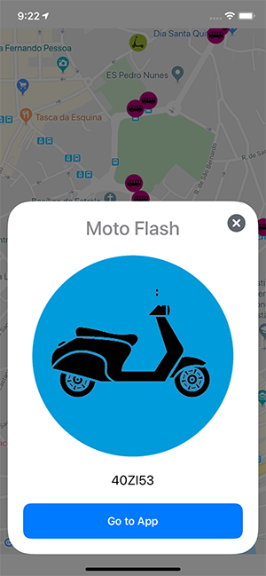

## Call to WebService and show maker in Google Maps iOS

Practica en la que se realiza la llamada de diferentes coordenadas contenidas en un JSON y presentación de informacion detallada basada en Google Maps al seleccionar un punto.

* Xcode 11.2.1
* iOS 13
* Swift
* TDD
* CocoaPods
* GCD
* UI
* MVC
* Git

